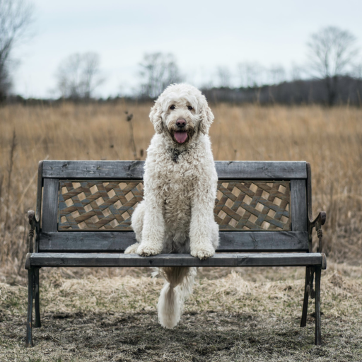

# min_Image2Image
Minimal implementation of Img2Img pipeline using SDEdit method.

# Method
- Inspired by SDEdit method for image editing. **The inductive bias**: when do reverse SDE, there is a trade-off between the “guide” and the real image based on time $t_0$ ($t_0 \in [0,1]$ denoted the time we solve SDE from). 
    - The layout/shape emerges at early denoising steps
    - The semantically meaningful details appear at later steps
- Our objective: given an real image, an text prompt -> want to make image contains layout information of real image and follow the text prompt.

Algorithm
```
1. get init latent of real image
2. get new scheduler with strength to solve SDE
3. add noise to init latent to the maximum noise level of current scheduler
4. denoising step from noise latent in step (3) with text guidance
```


# How to use
Change real image, strength and guidance scale in `img2img.py` 

```
python img2img.py
```
## Example
Real image



Text prompt: "An oil painting of a man on a bench"

Result with strength = 0.5, guidance scale = 7.5


